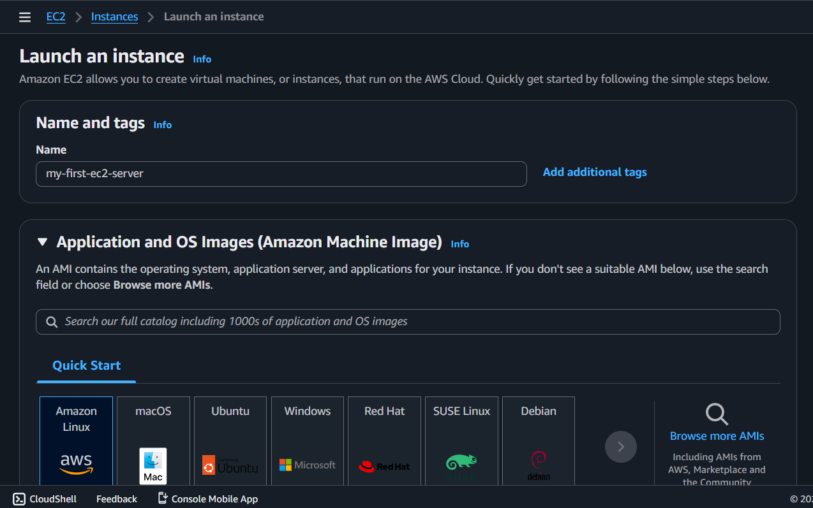
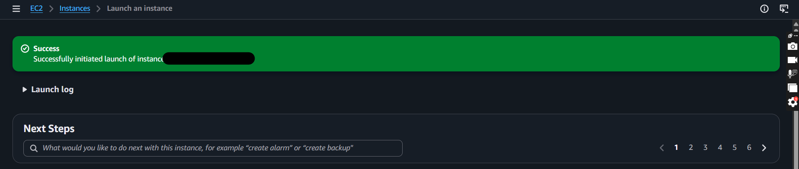
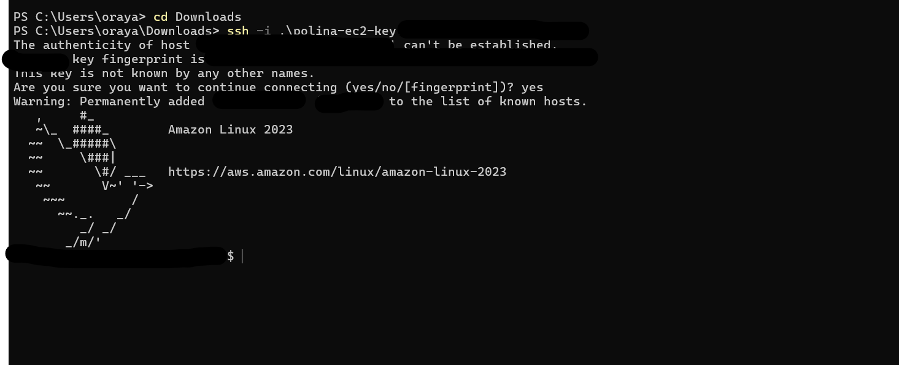
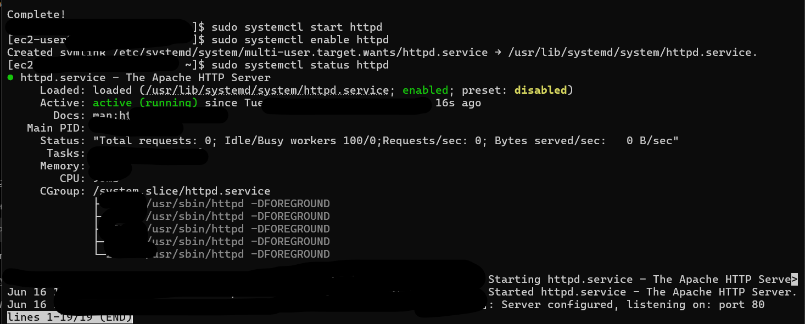
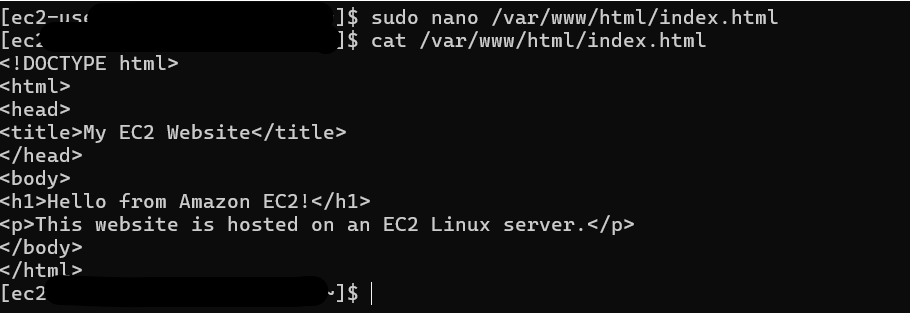
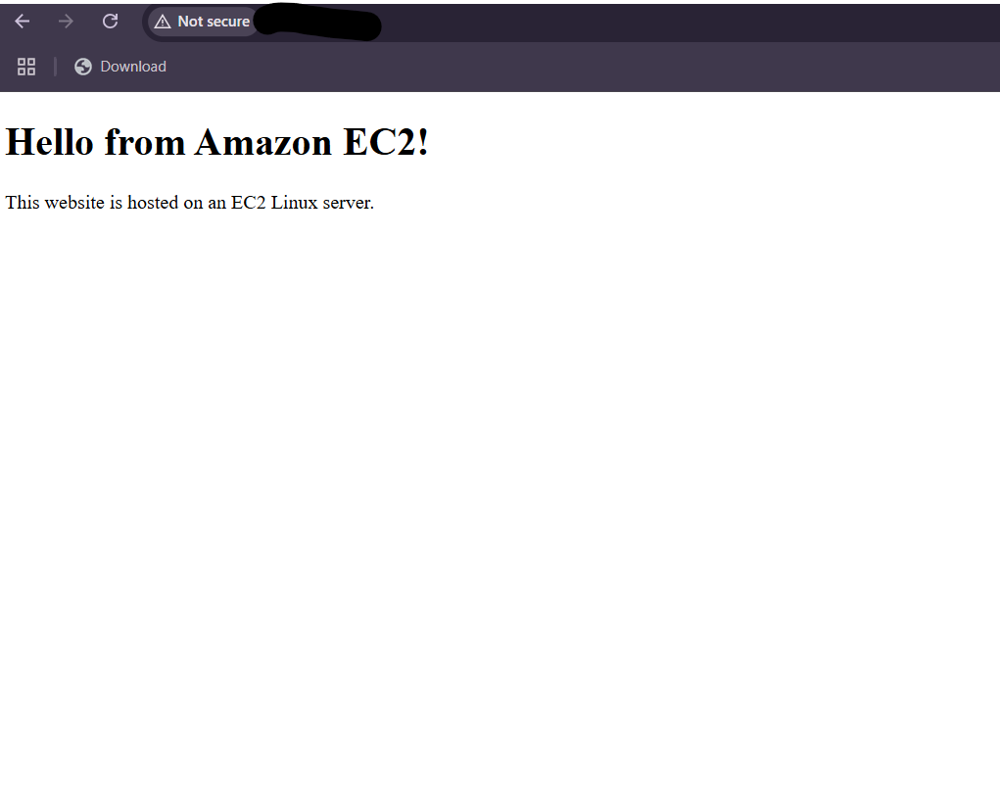

<h1><b>Project Journey</b></h1>

<h2>AWS EC2 Web Server Project</h2>

<h2>Why I Started This Project</h2>

After completing my first AWS project on Amazon S3 Static Website Hosting and my second project on AWS IAM User Management, I wanted to move beyond storage and security and explore the compute side of cloud computing.

While S3 allowed me to host a website without managing any servers, I became curious about how websites are hosted when full control over the operating system and server environment is required.

I wanted to understand:

* How cloud servers are created
* How administrators connect to them remotely
* How networking and security work
* How web servers host websites

To answer these questions, I decided to build my first web server using Amazon EC2.

---

<h2>Project Objective</h2>

The goal of this project was to:

* Understand Amazon EC2 fundamentals
* Launch a Linux server in AWS
* Configure network security
* Connect to a server using SSH
* Install and manage Apache Web Server
* Deploy a website on EC2
* Understand the difference between S3 and EC2 hosting

---

<h3>Step 1: Selecting Amazon Linux</h3>

The first step was choosing an operating system for the EC2 instance.

I selected **Amazon Linux 2023**, an AWS-optimized Linux distribution commonly used in cloud environments.

Since this was my first cloud server, I wanted to use an operating system designed specifically for AWS workloads and widely used in production environments.

<b>Amazon Linux Selection</b>

The screenshot below shows the Amazon Linux operating system selected during instance creation.



<h2>What I Learned</h2>

* EC2 instances require an operating system.
* Amazon Linux is optimized for AWS.
* Cloud servers work similarly to physical servers but are hosted in AWS data centers.

---

<h3>Step 2: Launching the EC2 Instance</h3>

After selecting the operating system, I launched my first EC2 instance.

An EC2 instance is essentially a virtual machine running in the cloud. It provides computing resources such as CPU, memory, storage, and networking.

Unlike Amazon S3, which is fully managed, EC2 gives users complete control over the operating system and software installed on the server.

<b>EC2 Instance Running</b>

The screenshot below shows my EC2 instance successfully launched and running.



<h2>Why This Matters</h2>

Launching an EC2 instance is one of the most fundamental tasks in AWS because applications, APIs, databases, and websites often run on cloud servers.

---

<h3>Step 3: Configuring Network Security</h3>

Before accessing the server, I needed to configure Security Groups.

Security Groups act as virtual firewalls and determine which traffic can reach an EC2 instance.

I configured:

* Port 22 (SSH) for secure remote access
* Port 80 (HTTP) for website access

SSH access was restricted to my own IP address while HTTP traffic was allowed so visitors could access the website.

<b>Security Group Configuration</b>

The screenshot below shows the Security Group and networking configuration.


<h2>What I Learned</h2>

* Security Groups function as virtual firewalls.
* Network access should follow security best practices.
* Firewall rules are critical for protecting cloud resources.

---

<h3>Step 4: Connecting to the Server Using SSH</h3>

After launching the server, I connected to it remotely from my Windows machine using SSH and the PEM key pair generated during instance creation.

SSH (Secure Shell) is a secure protocol used by cloud engineers and system administrators to manage Linux servers remotely.

This was my first experience directly interacting with a Linux server hosted in the cloud.

<b>SSH Connection Established</b>

The screenshot below shows the successful SSH connection to the EC2 instance.



<h2>Why This Matters</h2>

SSH is one of the most widely used tools in cloud computing because it allows administrators to securely manage infrastructure from anywhere.

---

<h3>Step 5: Installing Apache Web Server</h3>

Once connected to the server, I installed Apache HTTP Server.

Apache is responsible for receiving browser requests and serving website content to users.

After installation, I started the Apache service and configured it to start automatically whenever the server reboots.

<h2>Apache Installation and Status</h2>

The screenshot below shows Apache successfully installed and running.



<b>Commands Used</b>

```bash
sudo yum install httpd -y
sudo systemctl start httpd
sudo systemctl enable httpd
sudo systemctl status httpd
```

<h2>What I Learned</h2>

* Apache is a web server application.
* Services can be managed using Linux commands.
* Web servers process requests and deliver website content.

---

<h3>Step 6: Creating and Deploying the Website</h3>

With Apache running, the next step was to create a website.

I created a simple HTML page and placed it inside Apache's default web root directory:

```text
/var/www/html
```

Any file placed in this directory can be served to visitors through the web server.

This step transformed the EC2 instance from a Linux server into a functioning web server.

<h2>HTML File Created</h2>

The screenshot below shows the HTML file being created and added to the server.



<h2>Website Source Code</h2>

The HTML file used in this project can be found here:

[View index.html](website/index.html)

<h2>What I Learned</h2>

* Web servers require content to serve.
* Apache automatically serves files located in its web root directory.
* Linux file management is an important part of website deployment.

---

<h3>Step 7: Accessing the Website</h3>

After configuring Apache and deploying the HTML page, I opened the EC2 instance's public IPv4 address in a browser.

The successful webpage confirmed that:

* The EC2 instance was running
* Apache was operational
* Security Group rules were configured correctly
* The website had been deployed successfully

<h2>Website Successfully Hosted on EC2</h2>

The screenshot below shows the final website running on the EC2 server.



---

<h2>Key Difference Between Amazon S3 and Amazon EC2</h2>

<b>Amazon S3</b>

* Fully managed service
* Static website hosting
* No operating system management
* No server administration

<b>Amazon EC2</b>

* Full control over the operating system
* Supports dynamic applications
* Requires server configuration
* Requires software installation and maintenance

This project gave me hands-on experience managing the infrastructure myself rather than relying entirely on AWS-managed services.

---

<h2>Project Architecture</h2>

```text
Windows Laptop
       │
       ▼
SSH Connection
       │
       ▼
Amazon EC2 Instance
       │
       ▼
Apache HTTP Server
       │
       ▼
Hosted Website
```

---

<h2>What I Learned</h2>

Through this project, I gained practical experience with:

* Amazon EC2
* Linux Administration
* SSH
* Security Groups
* Apache Web Server
* Cloud Networking
* Website Deployment
* Public IP Addressing
* Infrastructure Management

---

<h2>Project Outcome</h2>

At the end of this project, I successfully:

* Launched an EC2 instance
* Configured network security
* Connected to a Linux server using SSH
* Installed Apache Web Server
* Created and deployed a website
* Hosted the website using a public IP address

This project provided my first real experience managing cloud infrastructure directly.

---

<h2>Conclusion</h2>

While my first AWS project focused on hosting a website using Amazon S3 and CloudFront, and my second project focused on securing AWS environments using IAM, this project introduced me to the compute layer of cloud computing.

For the first time, I worked directly with a Linux server, configured networking rules, installed software, and deployed a website from scratch.

This project strengthened my understanding of cloud infrastructure and gave me practical experience with one of the most important AWS services: Amazon EC2.

It marks another significant milestone in my AWS learning journey as I continue exploring VPC, Route 53, Lambda, DynamoDB, Auto Scaling, Load Balancers, and more advanced cloud architectures.
